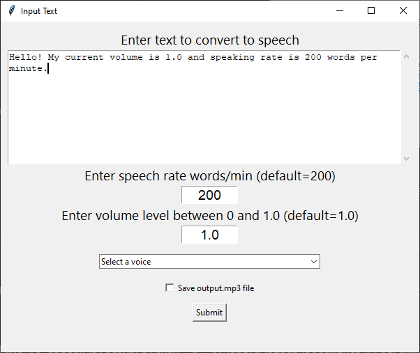
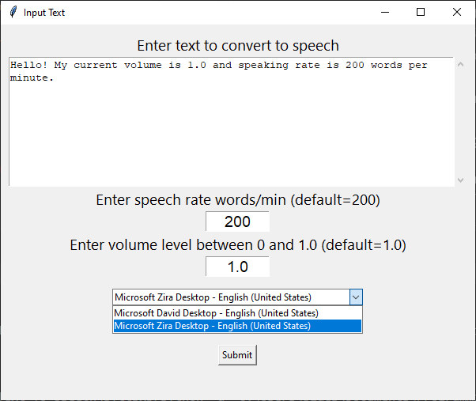

# Text-To-Speech (TTS) with Python using the pyttsx3 library

Python implementation of converting Text-To-Speech (TTS) offline with the *pyttsx3* library.  

#### Features:
- ✨Fully **OFFLINE** text to speech conversion
- 🗣️ Choose among different voices installed in your system
- 🎛 Control speed/rate of speech
- 🔊 Control Volume
- 🎶 Save the speech audio as a file (.mp3)
<br><br>

The input text is entered in a GUI, along with the speech speed/rate, volume, and voice type (e.g., male/female) shown 
below. The output is audio speech that can be saved as an .mp3 audio file.

<div align="center" width="100%">
  
</div> 
<br>
The voice type is selected from a dropdown menu, where the choices depend on the available voices installed on your Operating System.  


#### Included Text-To-Speech Engines by Operating System
|                         | Linux | macOS | Windows |
|-------------------------|:-----:|:-----:|:-------:|
| [AVSpeech][]            |       |   ✅︎  |         |
| [eSpeak][]              |   ✅︎  |   ✅︎  |    ✅︎   |
| [NSSpeechSynthesizer][] |       |   ✅︎  |         |
| [SAPI5][]               |       |       |    ✅︎   |

> [!NOTE]
> * AVSpeechSynthesizer support is still experimental.
> * NSSpeechSynthesizer is deprecated by Apple.

[AVSpeech]: https://developer.apple.com/documentation/avfoundation/speech_synthesis
[eSpeak]: https://github.com/espeak-ng/espeak-ng?tab=readme-ov-file#readme
[NSSpeechSynthesizer]: https://developer.apple.com/documentation/appkit/nsspeechsynthesizer
[SAPI5]: https://learn.microsoft.com/en-us/previous-versions/windows/desktop/ms723627(v=vs.85)
<br>
The example shown below is from the Microsoft Speech API 
(<a href="https://learn.microsoft.com/en-us/previous-versions/windows/desktop/ms723627(v=vs.85)">SAPI</a>)
on Windows.
<br>
<p align="center" width="100%">
  
</p>
<br>

After clicking on the submit button, the speech is output over the speakers and will be saved as an .mp3 audio file in the working directory of the application if this option is checked on the GUI.
<br><br>

## Table of Contents
- [Prerequisites](#prerequisites-heading)
- [Dependencies](#dependencies-heading)
- [Usage](#usage-heading)


<a name="prerequisites-heading"></a>
## Prerequisites
Python 3.x (tested in version 3.12.2)

<a name="dependencies-heading"></a>
## Dependencies
### pyttsx3

The only external dependency that needs to be installed is the `pyttsx3` library. The pip command for installing `pyttsx3` is given below. 

```console
pip install pyttsx3
```  

#### pyttsx3 References
- [PyPI](https://pypi.org/project/pyttsx3/)
- [Github](https://github.com/nateshmbhat/pyttsx3)
- [Documentation](https://pyttsx3.readthedocs.io/en/latest/)  

### Pydub 

Pydub is not strictly necessary for using pyttsx3, but it can be useful for converting the raw audio files generated by pyttsx3 into specific formats like MP3. The pip command for installing `pydub` is given below.  
```console
pip install pydub
```

#### pydub References
- [PyPI](https://pypi.org/project/pydub/)
- [Github](https://github.com/jiaaro/pydub/)
- [Documentation](https://pydub.com/)  

<a name="usage-heading"></a>
## Usage
The main python script is `tts-pyttsx3.py`, which can be ran directly in the console with  
```console
python tts-pyttsx3.py
```

